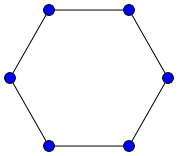
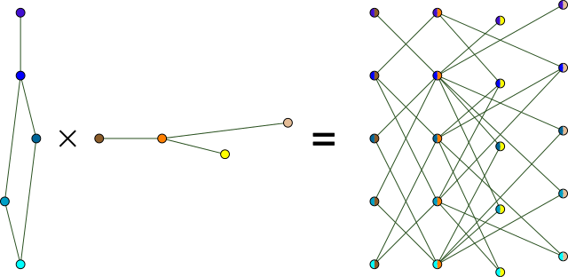

# Your basic func [][graphbuilddoc]

### Building graphs from functions only

[](#table-of-contents)

**The Petersen graph and its complement**,
*picture from [Wikipedia][wikipetersen2], [CC BY-SA 3.0][ccbysa30].*


## Table of contents

[Introduction](#introduction)  
[Implementation](#implementation)  
[Testing](#testing)  
[Performance](#performance)


## Introduction

This text is about the implementation of a Go tool based entirely on functions –
the API contains only immutable data types, and the code
is built on top of a `struct` with five `func` fields.

It's a tool for building **virtual graphs**.
In a virtual graph no vertices or edges are stored in memory,
they are instead computed as needed.
The tool is part of a larger library of generic graph algorithms:

- the package [graph][graph] contains the basic graph library and
- the subpackage [graph/build][graphbuild] is the tool for building virtual graphs.

There is an online reference for the build tool at [godoc.org][graphbuilddoc].


### The Petersen graph

Let's start with an example, the Petersen graph.
To describe this graph in a conventional graph library,
you would typically need to enumerate the edges

	{0, 1}, {0, 4}, {0, 5}, {1, 2}, {1, 6}, {2, 3}, {2, 7}, {3, 4},
	{3, 8}, {4, 9}, {5, 7}, {5, 8}, {6, 8}, {6, 9}, and {7, 9}

in one way or another.

However, if you ask a mathematician to describe the Petersen graph,
her answer would clearly be very different. Perhaps she would say:

> You get a Petersen graph if you draw a pentagon
> with a pentagram inside, with five spokes.


*Picture from [Wikipedia][wikipetersen], [CC BY-SA 3.0][ccbysa30].*

This [example][petersendoc] from the `graph/build` documentation
corresponds to the mathematical description.

```go
// Build a Petersen graph.
pentagon := build.Cycle(5)
pentagram := pentagon.Complement()
petersen := pentagon.Match(pentagram, build.AllEdges())
```

As you can see, the `Cycle`, `Complement` and `Match` functions
implement basic concepts in graph theory:
we start with a **cycle graph** of order 5,
compute its **complement**, and then combine these two graphs
by **matching** their vertices.

### A generic graph

It's also possible to define a new graph by writing
a **function** that describes the **edge set** of the graph.
This [code example][genericdoc]
shows how to build a directed graph containing all edges (*v*, *w*)
for which *v* is odd and *w* even.

```go
// Define a graph by a function.
g := build.Generic(10, func(v, w int) bool {
    // Include all edges with v odd and w even.
    return v%2 == 1 && w%2 == 0
})
```

The `build.Generic` function returns a virtual graph with 10 vertices;
its edge set consists of all edges (v, w), v ≠ w, for 
which the anonymous function returns true.


## Implementation

Let's start by looking at the main data type, a struct with five functions.

```go
type Virtual struct {
	// The `order` field is, in fact, a constant function.
	// It returns the number of vertices in the graph.
	order int

	// The `edge` and `cost` functions define a weighted graph without self-loops.
	//
	//  • edge(v, w) returns true whenever (v, w) belongs to the graph;
	//    the value is disregarded when v == w.
	//
	//  • cost(v, w) returns the cost of (v, w);
	//    the value is disregarded when edge(v, w) is false.
	//
	edge func(v, w int) bool
	cost func(v, w int) int64

	// The `degree` and `visit` functions can be used to improve performance.
	// They MUST BE CONSISTENT with edge and cost. If not implemented,
	// the `generic` or `generic0` implementation is used instead.
	// The `Consistent` test function should be used to check compliance.
	//
	//  • degree(v) returns the outdegree of vertex v.
	//
	//  • visit(v) visits all neighbors w of v for which w ≥ a in
	//    NUMERICAL ORDER calling do(w, c) for edge (v, w) of cost c.
	//    If a call to do returns true, visit MUST ABORT the iteration
	//    and return true; if successful it should return false.
	//    Precondition: a ≥ 0.
	//
	degree func(v int) int
	visit  func(v int, a int, do func(w int, c int64) (skip bool)) (aborted bool)
}
```
*Code from* **[build.go][build]**

### Cycle graphs

As a simple example, here's how to implement **cycle graphs**.
A cycle graph of order *n* contains the edges  
{0, 1}, {1, 2}, {2, 3},… , {*n*-1, 0}.



**Cycle graph of order 6**, *picture from [Wikipedia][wikicycle].*

For a basic implementation of this class of graphs,
we can write an `edge` function and use the generic implementation
`generic0` to fill in standard implementations of the other functions
in the `Virtual` struct.

In the following code, `g` is a virtual circle graph of order *n*
with edge costs equal to zero.

```go
g := generic0(n, func(v, w int) (edge bool) {
	switch v - w {
	case 1 - n, -1, 1, n - 1:
		edge = true
	}
	return
})
```

The generic implementation of the `degree` function iterates
over the *n* potential neighbors and calls the `edge` function
for each one to check if it really is a neighbor.
In this case, it's trivial to compute the degree more efficiently:

```go
// Precondition : n ≥ 3.
g.degree = func(v int) int { return 2 }
```

The generic implementation of the `visit` function also visits
all potential neighbors. 
This can of course be done much more efficiently:

```go
// Precondition : n ≥ 3.
g.visit = func(v int, a int, do func(w int, c int64) bool) (aborted bool) {
	var w [2]int
	switch v {
	case 0:
		w = [2]int{1, n - 1}
	case n - 1:
		w = [2]int{0, n - 2}
	default:
		w = [2]int{v - 1, v + 1}
	}
	for _, w := range w {
		if w >= a && do(w, 0) {
			return true
		}
	}
	return
}
```
*Code from* **[cycle.go][cycle]**

### Tensor product

Operators on virtual graphs are typically more complicated to implement,
but they can be defined using the very same pattern.
Here is an example showing how to implement the **tensor product** of two graphs.



**Tensor product**, *picture from [Wikipedia][wikitensor].*

The tensor product of g1 and g2 is a graph whose vertices
correspond to ordered pairs (v1, v2), where v1 and v2 are vertices
in g1 and g2, respectively. The vertices (v1, v2) and (w1, w2)
are connected by an edge whenever both of the edges {v1, w1} and {v2, w2}
exist in the original graphs.

In the new graph, vertex (v1, v2) gets index n⋅v1 + v2,
where n = g2.Order(), and index i corresponds to the vertex (i/n, i%n).

```go
func (g1 *Virtual) Tensor(g2 *Virtual) *Virtual {
	m, n := g1.Order(), g2.Order()

	g := generic0(m*n, func(v, w int) (edge bool) {
		v1, v2 := v/n, v%n
		w1, w2 := w/n, w%n
		return g1.Edge(v1, w1) && g2.Edge(v2, w2)
	})

	g.degree = func(v int) (deg int) {
		v1, v2 := v/n, v%n
		return g1.degree(v1) * g2.degree(v2)
	}

	g.visit = func(v int, a int, do func(w int, c int64) bool) (aborted bool) {
		v1, v2 := v/n, v%n
		a1, a2 := a/n, a%n
		return g1.visit(v1, a1, func(w1 int, c int64) (skip bool) {
			if w1 == a1 {
				return g2.visit(v2, a2, func(w2 int, c int64) (skip bool) {
					return do(n*w1+w2, 0)
				})
			}
			return g2.visit(v2, 0, func(w2 int, c int64) (skip bool) {
				return do(n*w1+w2, 0)
			})
		})
	}
	return g
}
```

*Code from* **[tensor.go][tensor]**

## Testing

Testing pure functions is typically straightforward –
in this case it's also a pure pleasure.

As always we need to check that the function calls
produce the expected result, but the rest of the testing procedure
can be fully automated. Given the `edge` and `cost` functions,
the behavior of `degree` and `visit` are fully determined and
can be automatically checked; it also works in reverse.

This is a blessing since the implementations tend to be quite different
and often either `edge` or `visit` is considerably easier to implement
than the other.

To test the `Cycle` function we simply need to check its output
and call the automated consistency test:

```go
for n := 0; n < 5; n++ {
	Consistent("Cycle", t, Cycle(n))
}
```

## Performance

### Iteration

The implementation of neigbor iteration is crucial for the performance
of any graph library.
Therefore all predefined building blocks and operations
try to implement the `visit` function in time proportional to
the actual number of neighbors.

However, with filter functions this is not possible.
In particular, graphs built by the `Generic` function
must visit all potenential neighbors during iteration.

### Caching

Caching can give large performance improvements but may be hard to automate.
When and what to cache depends on many factors, including the actual data,
hardware, and implementation.

Additionally, any graph, or part of a graph, which is described
by a filter function function cannot be cached since we don't
know if the user-defined functions are pure –
they may return different results given the same argument.

The solution is a function which activates caching
for a specified component:

```go
// Specific returns a cached copy of g with constant time performance for
// all basic operations. It uses space proportional to the size of the graph.
func Specific(g graph.Iterator) *Virtual
```

The implementation uses fixed precomputed lists to associate
each vertex in the graph with its neigbors.

Not only can `Specific` be used to cache selected components,
it can also be employed to import graphs
that are represented by more traditional data structures.

### Function inlining

In a library built entirely out of functions,
the cost of functions calls can be noticeable.
In fact, the more aggressive [inlining strategy][goinline]
introduced in Go 1.9 boosts the performance of this library with 10-20%.


#### Stefan Nilsson — [korthaj][korthaj]

*This work is licensed under a [Creative Commons Attribution 3.0 Unported License][ccby30].*

[build]: https://github.com/yourbasic/graph/blob/master/build/build.go
[ccby30]: https://creativecommons.org/licenses/by/3.0/
[ccbysa30]: https://creativecommons.org/licenses/by-sa/3.0/deed.en
[cycle]: https://github.com/yourbasic/graph/blob/master/build/cycle.go
[func]: https://github.com/yourbasic/func
[genericdoc]: https://godoc.org/github.com/yourbasic/graph/build#example-Generic
[goinline]: https://github.com/golang/proposal/blob/master/design/19348-midstack-inlining.md
[golang]: https://golang.org
[graph]: https://github.com/yourbasic/graph
[graphbuild]: https://github.com/yourbasic/graph/tree/master/build
[graphdoc]: https://godoc.org/github.com/yourbasic/graph
[graphbuilddoc]: https://godoc.org/github.com/yourbasic/graph/build
[korthaj]: https://github.com/korthaj
[petersendoc]: https://godoc.org/github.com/yourbasic/graph/build#example-Virtual-Match-Petersen
[tensor]: https://github.com/yourbasic/graph/blob/master/build/tensor.go
[wikicycle]: https://en.wikipedia.org/wiki/File:Undirected_6_cycle.svg
[wikipetersen]: https://en.wikipedia.org/wiki/File:Petersen1_tiny.svg
[wikipetersen2]: https://commons.wikimedia.org/wiki/File:Petersen_graph_complement.svg
[wikitensor]: https://en.wikipedia.org/wiki/File:Graph-tensor-product.svg

